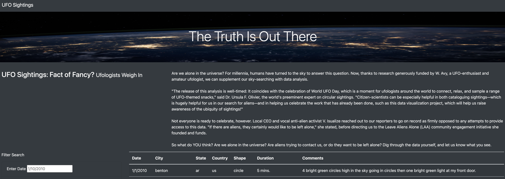
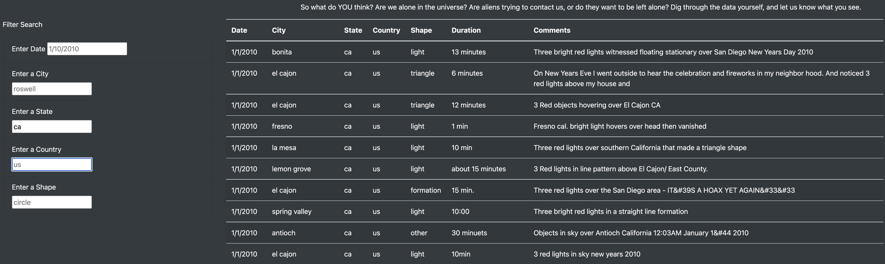
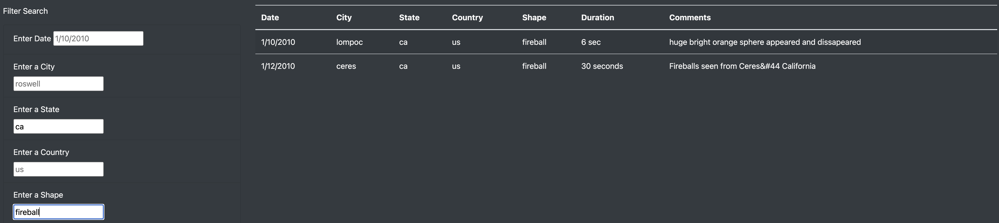

# UFO Sightings
UFO sightings with JavaScript and Bootstrap

## Overview
This study is an exercise in dynamic filtering of data via a browser interface. Given a JavaScript file containing an array of UFO sightings (as JavaScript objects), the goal is to create a webpage that can be used to filter the large amount of data and display it clearly in an organized way with a lot of visual appeal.

## Results: How to Perform a Search

- Navigate to the webpage homepage. A teaser article and all records are displayed. To return to the home page, click on the "UFO Sightings" link in the upper left corner.

---
- To perform a single search, enter your search term into one of the text boxes on the left, then enter or tab away. For example, here are all UFO sightings in California (only the first 10 sightings are shown in the image).

---
- To filter the California sightings even more, enter another search term in any of the other text boxes. What about fireballs in California? Perhaps this is why [California is on fire.](http://iscaliforniaonfire.com/)

## Summary

There are some drawbacks to the website as it currently stands:
- Although this webpage performs well, every change to a search field prompts a new round of filtering. With the addition of many more UFO sightings, this mechanism can become too slow if one wants to filter on several fields at once.
- Users might not know all the different "shapes" of sightings.

Proposed further development of the webpage could include:
- Fill in all the fields to filter, then click a "Search" button so that only one round of filtering is done.
- Instead of entering words for shapes in a text box, have an area of checkboxes with all possible shapes so users do not have to guess at possible shapes.
- It would be nice to be able to enter a range of dates instead of just a single date.